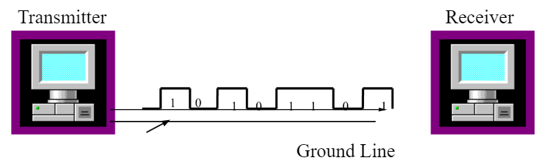
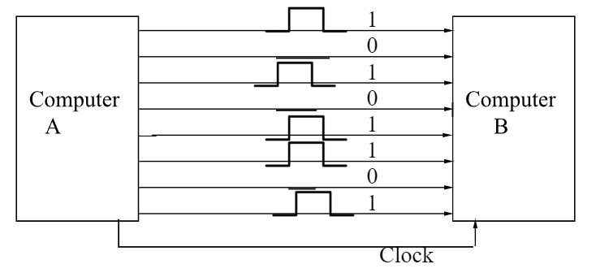

## Chapter 15: Transmission Methods

_Originally created 5 April 2021, by Maxwell Hauser — Updated 8 October 2025._

_Builds upon material from Chapter 14: Transmission Types._

---

### Overview

There are two types of transmission methods used for sending digital signals from one station to another across a communication channel: **serial transmission** and **parallel transmission**.

---

## Serial Transmission

In serial transmission, information is transmitted **one bit at a time** over one wire, as shown in the figure below.

> 

**Advantages of Serial Transmission:**
- Requires only one wire (or one pair of wires)
- Lower cost for long-distance communication
- Less susceptible to interference over long distances

**Disadvantages of Serial Transmission:**
- Slower than parallel transmission
- Requires more complex timing and synchronization

---

## Parallel Transmission

In parallel transmission, multiple bits are sent **simultaneously**, one byte or more at a time, instead of bit by bit as in serial transmission. The figure below shows how computer A sends eight bits of information to computer B at the same time by using eight different wires. Parallel transmission is faster than serial transmission at the same clock speed.

> 

**Advantages of Parallel Transmission:**
- Faster data transfer rate
- Simpler timing requirements for short distances

**Disadvantages of Parallel Transmission:**
- Requires multiple wires (more expensive)
- Susceptible to signal skew over long distances
- Limited to short-distance communication

---

## Summary

1. **Serial Transmission:**
   - One bit at a time over one wire
   - Suitable for long-distance communication
   - Lower cost but slower speed

2. **Parallel Transmission:**
   - Multiple bits simultaneously over multiple wires
   - Suitable for short-distance, high-speed communication
   - Higher cost but faster speed

3. **Applications:**
   - Serial: USB, Ethernet, Serial ports
   - Parallel: Internal computer buses, old printer ports